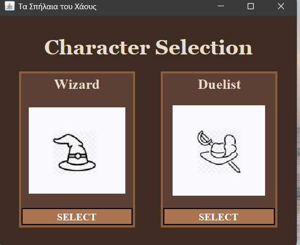
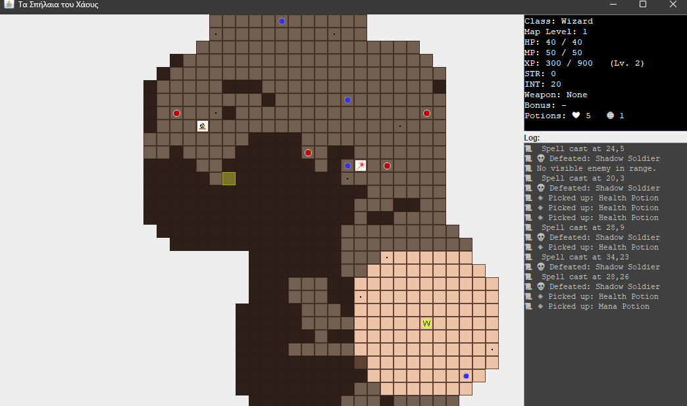

# Caves of Chaos

## ◆ Description

The subjects of the Court of Chaos never gain their full powers until they traverse the **Labyrinth of Logrus**, facing the **Serpent of Chaos**, a trial requiring immense preparation and mental fortitude.

You, as a noble of the Court of Chaos, must:
- Pass the trial
- Conquer the Labyrinth and the Serpent of Chaos
- Obtain the **Jewel of Judgement**, said to be one of the eyes of the Serpent

The game world consists of caves spanning **10 levels**, each represented as a 2D grid of tiles (walls, floor, exits). At the final level awaits the **Serpent of Chaos**, guarding the Jewel.

<p align="center">
  
</p>


<p align="center">
  
</p>


## ◆ Gameplay

- **Movement:** W (up), A (left), S (down), D (right)
- **Attack:** Space
- **Use items:**
    - H for health potions
    - M for mana potions
- **Rest:** R (restores a percentage of HP and MP)
- **Change weapon:** P (swap current weapon with one on the tile)

---

## ◆ Players

In **Caves of Chaos**, players can choose between two character classes, each with unique stats, abilities, and progression.

### ▸ Duelist

The **Duelist** is a warrior-type class with high Hit Points (HP) but lower damage output compared to the Wizard.

| Level | Base HP | Base MP | Strength | Intellect |
|-------|---------|---------|----------|-----------|
| 1     | 30      | -       | 10       | -         |
| 2     | 60      | -       | 20       | -         |
| 3     | 80      | -       | 25       | -         |
| 4     | 90      | -       | 30       | -         |
| 5     | 100     | -       | 35       | -         |
| 6     | 140     | -       | 45       | -         |

- **Hit Points (HP):** Represents how much damage the character can withstand. Reaching 0 results in game over.
- **Strength:** Determines physical attack damage.

---

### ▸ Wizard

The **Wizard** is a mage-type class with lower HP but higher damage via spells. It uses **Mana Points (MP)** as an additional resource.

| Level | Base HP | Base MP | Strength | Intellect |
|-------|---------|---------|----------|-----------|
| 1     | 20      | 30      | -        | 10        |
| 2     | 40      | 50      | -        | 20        |
| 3     | 50      | 70      | -        | 30        |
| 4     | 55      | 90      | -        | 40        |
| 5     | 60      | 110     | -        | 50        |
| 6     | 80      | 140     | -        | 70        |

- **Mana Points (MP):** Required to cast spells. Casting a spell costs **5 MP**.
- **Intellect:** Determines spell damage.
- If MP runs out, the Wizard cannot attack until recovering mana via items or rest.

---

### ▸ Leveling & Experience

- **Experience Points (XP):** Earned by defeating enemies and overcoming obstacles.
- Level progression:
    - **1:** 0-299 XP
    - **2:** 300-899 XP
    - **3:** 900-2699 XP
    - **4:** 2700-6499 XP
    - **5:** 6500-13999 XP
    - **6:** 14000+ XP

Upon leveling up, the character's base stats increase according to their class table.

---

## ◆ Items

Items play a key role in the player's survival and progression. Items are visible on revealed tiles of the map and fall under three main categories.

### ▸ Consumables

**Consumables** are items with limited uses that restore character stats. When the player steps on a tile containing consumables, they are automatically picked up and added to the inventory.

- **Health Potions**
    - Restore a specific amount of HP (10HP)
    - Cannot exceed Maximum Hit Points.

- **Mana Potions**
    - Restore a specific amount of MP (25MP)
    - Have no effect if the player does not have Mana Points.

---

### ▸ Weapons

Players can equip **one weapon at a time**. Switching weapons (by pressing **P**) will drop the currently equipped weapon onto the tile.

Weapons provide **item effects** that modify base stats such as Strength or Intellect.

#### ▶ Wizard Weapons

| Weapon Name  | Type  | Bonus |
|--------------|-------|-------|
| Arcane Wand  | Wand  | +2 Intellect |
| Fire Staff   | Staff | +4 Intellect |

#### ▶ Duelist Weapons

| Weapon Name | Type  | Bonus |
|-------------|-------|-------|
| Iron Sword  | Sword | +2 Strength |
| Great Axe   | Axe   | +4 Strength |

---

### ▸ Traps

**Traps** are considered consumables with **negative HP replenishment**. When a player steps on a trap tile:

- The trap is automatically triggered, dealing damage to the player.
- Trap damage is proportional to player's level.

---

## ◆ Enemies

Enemies in **Caves of Chaos** have simplified RPG attributes:

- **Name**
- **Hit Points (HP)**
- **Damage**
- **Experience Points (XP)** awarded upon defeat
- **Visibility Range:** the distance at which they detect the player

### ▸ Behavior

- Enemies detect the player if within their **visibility radius**, regardless of walls.
- Move towards the player aiming to reduce distance (simple pathing).
- Can attack only when adjacent to the player.
- Damage can be fixed or calculated via dice rolls (e.g. *2d6+10* means roll two 6-sided dice and add 10).

---

### ▸ Enemy Types

| Name           | HP  | Damage      | XP   | Visibility |
|----------------|-----|-------------|------|------------|
| Shadow Soldier | 5   | 2           | 30   | 4 |
| Ancient Guard  | 15  | 5           | 50   | 7 |
| Greater Shade  | 50  | 12          | 120  | 7 |
| Chaos Knight   | 60  | 20          | 150  | 9 |
| Shadow Serpent | 20  | *4d6+10*    | 100  | 4 |
| Chaos Beast    | 80  | *2d6+10*    | 200  | 5 |
| Pattern Shade  | 50  | *3d6+10*    | 400  | 10 |

---

### ▸ Final Boss: Chaos Serpent

The **Chaos Serpent** resides on the **10th level** as the ultimate challenge.

| Attribute | Value |
|-----------|-------|
| **HP**    | 1500 |
| **Damage** | *8d6+10* |
| **XP**    | - |
| **Visibility** | 10 |

- **Persistence:** Unlike other enemies, the Chaos Serpent remains on Level 10 between visits, retaining its HP.
- **Strategy:** Players may need multiple visits to defeat it, attacking then retreating to recover.
- Upon defeat, it drops the **Crisis Gem (Jewel of Judgement)**, completing the game.

---

### ▸ Enemy Drops

- Defeated enemies grant **XP** based on their type.
- The **Chaos Serpent** drops the **Crisis Gem**, marking victory.

---

## ◆ How to Run

1. **Clone the repository:**
   ```bash
   git clone https://github.com/yourusername/caves-of-chaos.git
   cd caves-of-chaos
